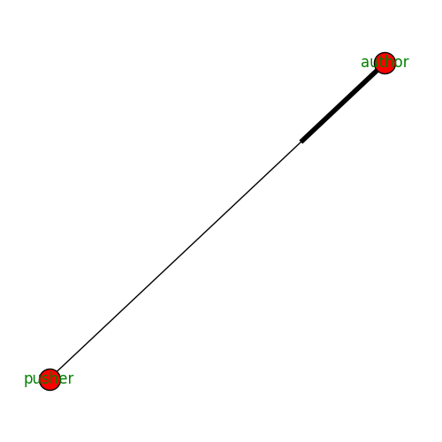
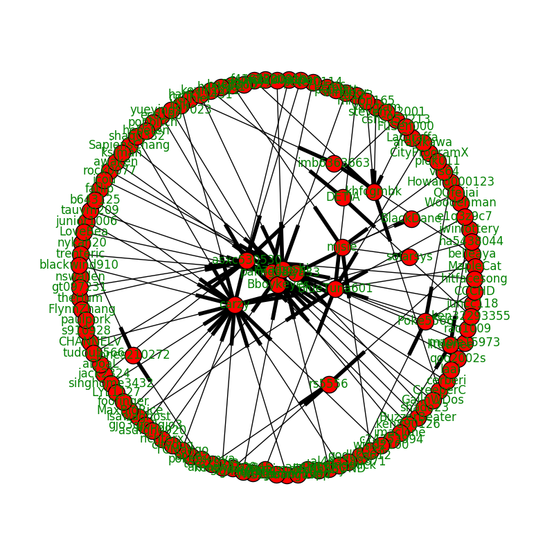

# PTT-ID-correlator

## 說明
利用爬蟲爬取PTT網頁版推文資料，並將推文資料繪製成作者與推文者之間的有向圖。

## 功能
* 從PTT網頁版的各熱門看板爬取推文資料 (保存為JSON格式)
* 繪製作者-推文者的有向關係圖

## 使用方式
    $ python PTT-ID-correlator.py [-h]
                                  (--update |
                                   --view_board_list |
                                   --run_save_all |
                                   --run_show_all |
                                   --run_save BOARDNAME |
                                   --run_show BOARDNAME)
 (首次使用需先更新資料庫，利用爬蟲爬取各看板10頁的資料)

### 各參數說明
    --update
更新資料庫

    --view_board_list
檢視資料庫中可供分析的看板列表

    --run_save_all
計算資料庫中所有推文資料 (花費較長時間) ，並儲存成圖片檔案

    --run_show_all
計算資料庫中所有推文資料 (花費較長時間) ，並顯示在互動式的視窗中

    --run_save BOARDNAME
計算資料庫中特定看板 (參數 BOARDNAME) 的推文資料，並儲存成圖片檔案

    --run_show BOARDNAME
計算資料庫中特定看板 (參數 BOARDNAME) 的推文資料，並顯示在互動式的視窗中

## Author-Pusher Pair 圖例

## 範例
